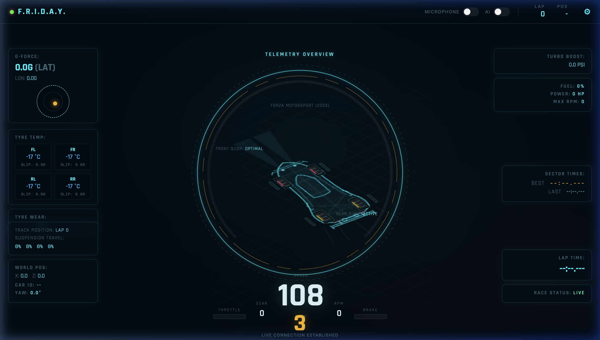

# Pitwall — F.R.I.D.A.Y. AI Race Engineer

**Pitwall** is a live telemetry dashboard and AI-powered race engineer for sim racing (Forza Horizon/Motorsport). It captures real-time UDP telemetry data from the game and uses a highly optimized physics engine and lightweight AI models to give you dynamic, context-aware audio feedback via a custom "F.R.I.D.A.Y." persona.



## Features

- **Live Telemetry HUD**: A beautiful, Iron Man / cyberpunk-themed dashboard with frosted glass UI, RPM rings, G-force meters, and dynamic wireframe rendering of the car's state.
- **F.R.I.D.A.Y. AI Engineer**: Connects to the Groq API (using ultra-fast models like `allam-2-7b`) and Edge-TTS for low-latency, clinical, hyper-efficient audio commentary.
- **Dynamic Physics Engine**: Infers car mass, kinetic energy dissipation during crashes, and detects tire blowouts, snaps, and drifts based solely on raw telemetry (speed, G-forces, slip angles).
- **Two-Way Comms**: Integrated continuous mic allows you to speak to F.R.I.D.A.Y. during the race, powered by Groq's Whisper API.
- **Standalone Windows Build**: Easily compiled into a single `.exe` file that starts a local Flask server and opens the dashboard in a lightweight PyWebView window.

## Architecture

- **Backend**: Python (Flask, Flask-SocketIO, Groq API, Edge-TTS)
- **Frontend**: HTML5 Canvas, Vanilla CSS, JS WebSockets
- **Optimization**: The UI rendering loop is highly optimized. The complex wireframe car chassis is rendered exactly *once* to an off-screen canvas buffer, reducing GPU/CPU load to near-zero while maintaining a dynamic 60FPS feel for rolling wheels and active suspension.

## Limitations

- **Dual-Display Setup Required:** Because Forza is typically played in full-screen mode, you will need either a **second monitor** or a **second device** (like a phone, tablet, or a separate laptop) to view the Pitwall dashboard while you race. 
  - *If using a second device:* Ensure it is connected to the same Wi-Fi network. Find your main PC's local IP address (e.g., `192.168.1.100`) and access the dashboard from the second device's browser at `http://<YOUR_IP>:6900`.

## Setup Instructions (Windows - Primary)

### 1. Prerequisites
- Install **Python 3.10+**. Ensure you check the box to "Add Python to PATH" during installation.
- Get a free API Key from [Groq](https://console.groq.com/keys) (required for the F.R.I.D.A.Y. AI).

### 2. Installation & Building
Clone this repository to your local machine:
```bash
git clone https://github.com/sathwik-e/Pitwall.git
cd Pitwall
```
Double-click `build.bat`. This script will automatically install all dependencies and compile the app into a standalone `Pitwall_Live_Telemetry.exe` that runs silently without a terminal. 

### 3. Application Configuration
1. Launch the compiled `Pitwall_Live_Telemetry.exe`.
2. Click the **⚙️ Gear Icon** in the top right of the dashboard.
3. Enter your **Groq API Key** and save.

### 4. Forza Game Configuration
You must tell Forza to broadcast telemetry data to Pitwall.
1. Launch Forza Horizon 4, 5, or Forza Motorsport.
2. Go to **Settings -> HUD and Gameplay**.
3. Scroll down to **Data Out** and turn it **ON**.
4. Set **Data Out IP Address** to `127.0.0.1`.
5. Set **Data Out IP Port** to `5300`.

## Mobile & iOS Setup (Second Screen)

You can run the Pitwall server on your main Windows PC and use your iPhone, iPad, or Android device as your telemetry screen!

1. Start Pitwall on your PC (via `Pitwall_Live_Telemetry.exe` or `app.py`). 
2. Ensure your mobile device is connected to the **same Wi-Fi network** as your PC.
3. Find your PC's local IPv4 address (Open Command Prompt and type `ipconfig`). For example: `192.168.1.100`.
4. Open Safari or Chrome on your mobile device and navigate to `http://192.168.1.100:6900`.
5. **Important for iOS Safari**: To allow F.R.I.D.A.Y.'s audio commentary to play, you must interact with the page first. Simply tap the **AI Toggle Switch** off and on again in the top right to unlock iOS audio permissions.

## Mac OS Setup (Porting)

If you are running Forza on an Xbox or a separate Windows PC on the same network, you can run Pitwall on a Mac to serve as your telemetry screen.
1. Install Python 3.10+ and run `pip3 install -r requirements.txt`.
2. Start the telemetry server manually: `python3 app.py`.
3. Find your Mac's local network IP address (e.g., `192.168.1.50`).
4. **On your Xbox/Windows PC running Forza**: Go to the Data Out settings and set the **Data Out IP Address** to your Mac's IP address (`192.168.1.50`) instead of `127.0.0.1`. Keep the port at `5300`.
5. View the dashboard on your Mac at `http://localhost:6900`.

---
*Built for absolute performance and immersion on the virtual track.*
